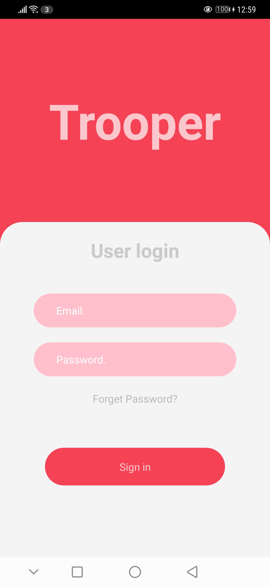

# Phone Cashier and Stock Checkment

## Table of Content

- [Requirement](#requirement)

- [Run Backend for API use](#run-backend-for-api-use)

- [Application user manual](#application-user-manual)

## Requirement

1. Application folder

2. Backend folder

3. Xampp

## Run Backend for API use

1. **เมื่อ Download backend ไปแล้วให้ใช้คำสั่ง npm i**

2. **ใช้งานโปรแกรม xampp เพื่อรัน Database**

3. **สร้าง Database ชื่อ cashier**

4. **ใช้คำสั่ง npm run dev เพื่อเปิดใช้งาน backend**

## Application user manual

1. **Login เข้า application**

> **Email:** user@email.com
> **Password :** password

2. **หน้าสำหรับการลืมรหัสผ่าน**

3. **หน้าเมนูการใช้งาน ดังนี้**
   
   - Profile
   
   - Stock Mode
   
   - Cashier Mode

4. **หน้า Profile บอกข้อมูลผู้ใช้**

> ปุ่ม Log Out ออกสู่ระบบ
> 
> ปุ่มกลับไปที่หน้าเมนูการใช้งาน

5. **Stock Mode แสดงรายการคลังสินค้า**

> ปุ่ม Add เพิ่มรายการสินค้า
> ปุ่ม Remove ลบรายการสินค้า
> 
> ปุ่ม Order ข้อมูลสั่งสินค้า

6. **Add Stock เพิ่มรายการสินค้า**

> ปุ่ม Tap เพื่อแสกน barcode
> ตรวจดูรายละเอียดสินค้า
> ปุ่ม Confirm รายการสินค้า

7. **Remove Stock ลบรายการสินค้า**

> ปุ่น Tap เพื่อแสกน barcode
> ตรวจดูรายละเอียดสินค้า
> ปุ่ม Confirm รายการสินค้า

8. **Summary หน้าตรวจเช็ครายการสินค้า**

> ปุ่ม Confirm ยืนยันรายการสินค้า

9. **Order Stock สำหรับสั่งสินค้า**

> รายการสินค้าที่ต้องการสั่ง

10. **กดที่รายการที่ต้องการสั่ง**

> แสดงช่องทางติดต่อสินค้า
> ปุ่ม Call ติดต่อทางเบอร์โทรศัพท์

11. **Register Product สำหรับใส่ข้อมูลสินค้าใหม่**

> กรอกรายเอียดข้อมูลสินค้า
> 
> ปุ่ม Scan เพื่อเก็บค่า barcode
> 
> ปุ่ม Confirm ใส่ข้อมูลสินค้าสู่ระบบ

12. **Cashier Mode สำหรับการซื้อขายสินค้า**

> ปุ่ม Tap ด้านล่างเพื่อแสกน barcode

13. **Detail รายการสินค้าในตระกร้า**

> ปุ่มเพิ่ม,ลด จำนวนสินค้า

14. **Summary สรุปรายสินค้าในตระกร้า**

> สรุปราคาสินค้าในตระกร้า
> ปุ่ม Checkout สำหรับชำระเงินสด

15. **QR code สำหรับรับชำระเงินผ่าน QR code (mobile banking)**

